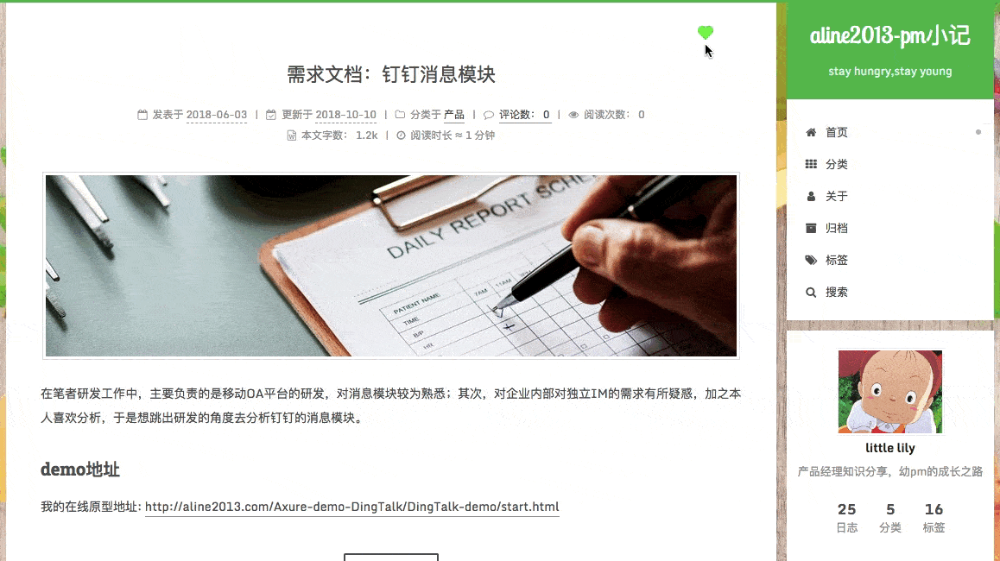

# aline2013-pm小记
首先，我的博客地址是: [http://www.aline2013.com](http://www.aline2013.com)，欢迎戳一戳，在博客评论区留下你的意见，我会一一回复，更加完善~

我的博客采用的是hexo+github page的方式搭建网站，主题是用next，并购买了阿里云的域名。
最开始是直接用next主题，没有做任何的改动，直到我看到了大神级别的博客，很有趣，而且易用性很高。
虽然我的博客难以达到大神级别，但进步的空间还是很大的（呵呵呵……）。于是我就深度地改造了一下我的博客，依然采用next主题，但将很多默认不展示的选项都用上了。

现在我的博客文章在百度，谷歌都能搜索到，也添加了站内搜索，也有阅读数、阅读时间、分享功能，以及更多的动态效果，是我满意的一个版本，下面展示一下我的博客的站内搜索功能吧。

### 我的博客改造之路###
[hexo+github page助我搭建博客](http://www.aline2013.com/article/blog-new.html)

[配置博客主题next+评论系统disqus](http://www.aline2013.com/article/blog-inhance_theme&comment.html)

[优化博客图片不显示的问题](http://www.aline2013.com/article/blog-image_notshow.html)

[博客升级-hexo,next](http://www.aline2013.com/article/blog-update_hexo&next.html)

[更换评论系统-valine](http://www.aline2013.com/article/blog-inhance_comment_valine.html)

[博客深度改造之踩坑记](http://www.aline2013.com/article/blog-inhance_deep.html)

**重点推荐一下**,博客改造之踩坑记，因为参考很多大神很早就加了很多功能，虽然写下很多优质的博客优化文档，但因hexo、next环境等变化很大，导致踩了很多坑，这篇文章都有记录。同时，也标注了添加某个功能后的动态展示图。

未完待续……